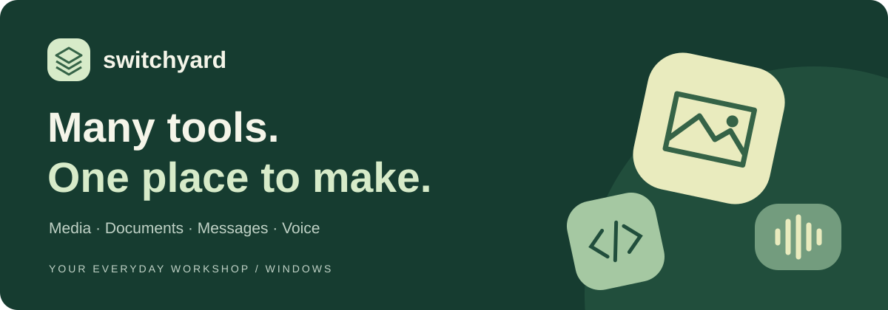
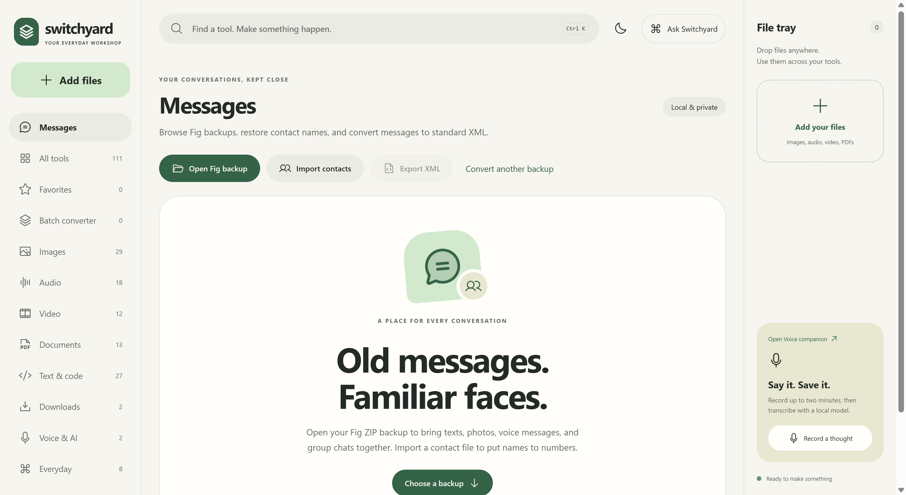

<p align="center"></p>

<p align="center"><strong>A local workshop for your files. Made for Windows.</strong><br>Turn photos, recordings, documents, and message backups into something useful.</p>

<p align="center">
  <a href="https://github.com/Fleishigs/Switchyard/releases/latest"><strong>Download for Windows →</strong></a> ·
  <a href="https://fleishigs.github.io/Switchyard/">Explore the documentation</a> ·
  <a href="docs/QUICK-START.md">Quick start</a>
</p>

---

## Your next idea. All the right tools.

Switchyard brings **112 tools**, a batch converter, a Messages workspace, and a local Voice companion into one app. Processing engines and English speech/OCR models come with the installer, so local file tasks work offline. Downloads need an internet connection.

| Workspace | What you can do |
| --- | --- |
| **Images** | Resize, crop, convert, adjust, and upscale with local Upscayl models. AI upscaling needs a Vulkan-capable GPU. |
| **Audio & video** | Trim with a visual timeline, convert formats, remove audio, transcribe recordings, and separate vocals from instruments. |
| **Documents** | Work with PDFs, extract text, run English OCR, and convert supported office documents. |
| **Batch converter** | Choose compatible destinations for images, media, documents, archives, fonts, meshes, subtitles, SQLite tables, and structured data. |
| **Messages** | Browse Fig ZIP/NDJSON backups, search conversations, import VCF contact names, and export SMS Backup & Restore XML with supported attachments. |
| **Text & everyday tools** | Format structured data, use text and developer utilities, generate QR codes, and run everyday calculations. |
| **Voice** | Dictate locally with **Ctrl+Shift+Space**, optionally paste into the original window, or use the small set of exact Windows commands. |

<p align="center"><br><sub>Messages lives inside Switchyard. Screenshot from a verified earlier build; details may change.</sub></p>

## Install & make your first result

1. Open the [latest release](https://github.com/Fleishigs/Switchyard/releases/latest) and download **Switchyard-Setup-1.1.2.exe**. The ZIP/TAR source downloads are for developers.
2. Run the installer, choose a location, and open Switchyard. This release targets **Windows x64** and is **unsigned**; Windows may show a publisher warning. Verify the download before deciding whether to run it.
3. Add a file, press **Ctrl+K** to find a tool, adjust its settings, and create a result.
4. Preview, compare where supported, save elsewhere, or reuse the result. **Queue & history** keeps jobs together; original inputs are preserved.

**Download:** about **953 MB** for v1.1.2, 21.46% smaller than v1.1.1 with the offline engines retained. **Installed payload:** about **4.04 GB**, plus temporary installation space and your outputs. See the [release measurements](docs/RELEASE-1.1.2.md).

To check the download in PowerShell, compare this result with the release's `SHA256SUMS-1.1.2.txt`:

```powershell
Get-FileHash .\Switchyard-Setup-1.1.2.exe -Algorithm SHA256
```

## Keep your work close

- File processing, English dictation, OCR, and vocal separation run locally. **Ask Switchyard** finds existing tools; it is not a cloud chat service.
- Outputs and history live in Electron's Switchyard user-data folder. Messages stores an imported copy there. Clearing it removes that copy and imported names, leaving the source backup intact.
- The Voice companion stores settings and its latest transcript in `%LOCALAPPDATA%/SwitchyardVoice`. Local storage is not a claim of encryption.
- YouTube downloads contact the source service. The installer includes yt-dlp and Deno; availability, access restrictions, and service changes can still affect downloads.

## Learn the workflows

- [Complete illustrated guide and searchable tool catalogue](https://fleishigs.github.io/Switchyard/)
- [Quick start: files, messages, batch conversion, and voice](docs/QUICK-START.md)
- [Voice companion: behavior and building](voice/README.md)
- [Latest release and extraction verification](docs/RELEASE-1.1.2.md)
- [Outcome audit and compatibility limits](docs/OUTCOME-AUDIT.md)
- [Third-party engines, origins, and licenses](THIRD-PARTY-NOTICES.md)

## Build from source

The source checkout does **not** include downloaded engine binaries or models. A fresh clone needs Node.js, .NET 8, and the resource folders listed in [`package.json` → `build.extraResources`](package.json). There is no complete one-command engine bootstrap.

```powershell
npm.cmd ci
# Populate the engine binaries, models, and licenses in build.extraResources.
powershell.exe -NoProfile -ExecutionPolicy Bypass -File scripts/prepare-youtube-runtime.ps1
dotnet publish voice/SwitchyardVoice.csproj -c Release -r win-x64 --self-contained true -o voice/publish
npm.cmd run build
npm.cmd start
```

For a Windows installer, run `npm.cmd run package`. It writes to `release-final`; the newest published EXE and its checksum are retained locally. See [workspace and release rules](AGENTS.md). `npm.cmd test` runs backend checks; engine-dependent checks need the corresponding resources available. UI and packaged-app checks live under `tests`.

## Know the boundaries

Supported extensions do not guarantee support for every codec, encrypted file, or damaged input. PDF-to-document conversion extracts text rather than recreating page layout; text-only PDF creation uses a Latin font. Fonts and mesh conversions have preservation limits. Some files FFmpeg can convert cannot play directly in the app. English voice accuracy varies with the microphone, CPU, and speech.

Fig ZIP imports allow up to 10,000 files, 2 GB total, and 250 MB per entry; unsafe paths and links are rejected. Failed imports preserve the previous backup. XML export refuses missing binary attachments and preserves an existing destination if conversion fails; base64 attachments can make exports large.

Switchyard's own code is [MIT licensed](LICENSE). Bundled engines and models retain separate licenses; MIT does not cover the entire installer. See [third-party notices](THIRD-PARTY-NOTICES.md) for origins and redistribution requirements.

Found a problem? [Open an issue](https://github.com/Fleishigs/Switchyard/issues) with the version, tool, and reproducible steps. Use synthetic examples and remove personal paths, messages, and credentials from logs.
